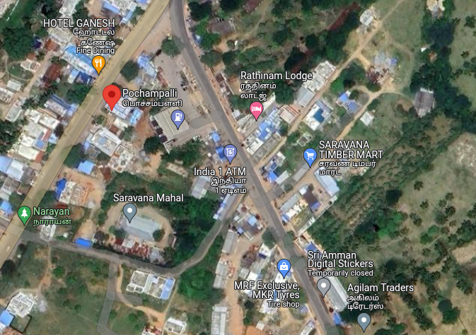
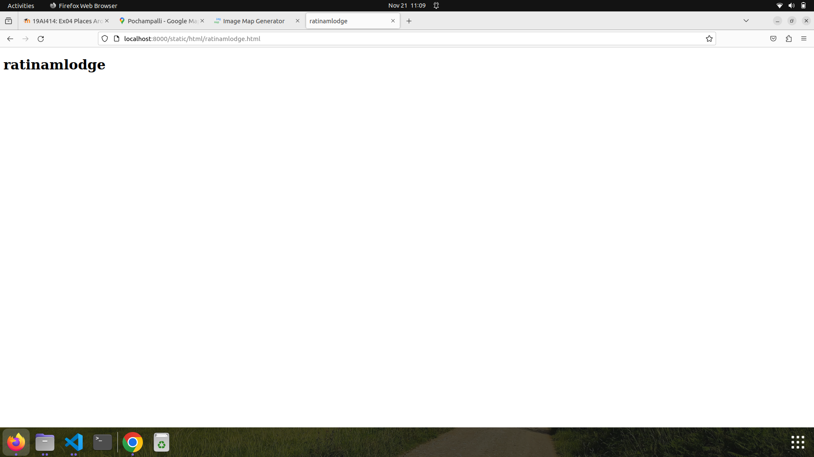
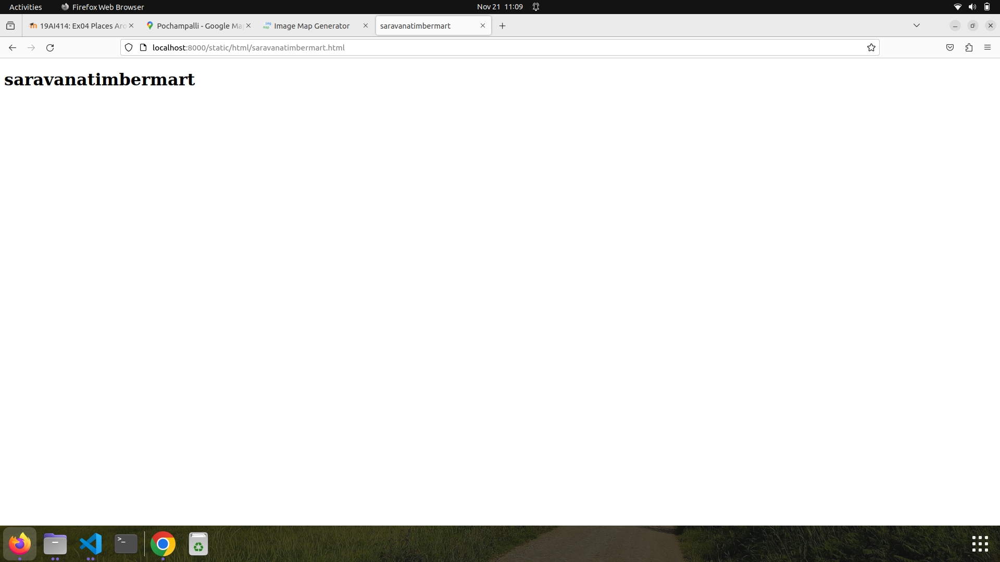
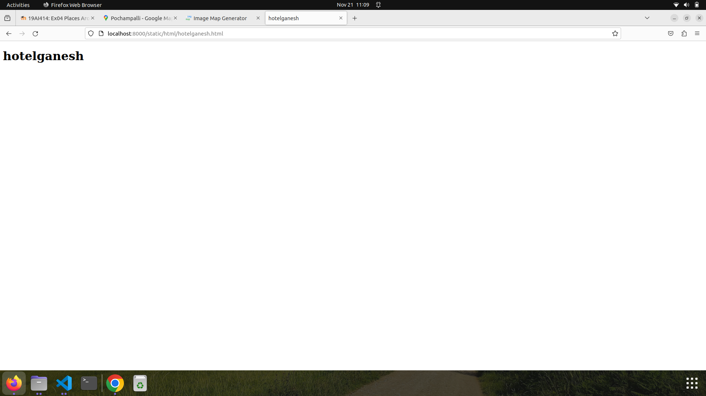
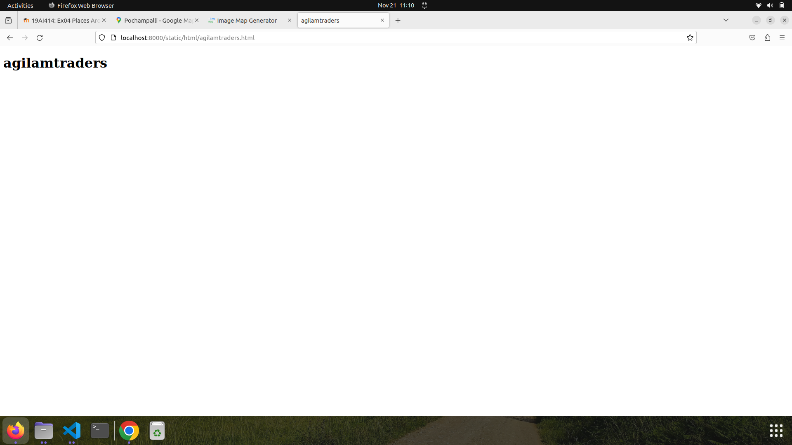

# Places Around Me
## AIM:
To develop a website to display details about the places around my house.

## Design Steps:

### Step 1:
Write the code appropirately.
### Step 2:
Run the code
## Code:
```
<!DOCTYPE html>
<html>
    <head>
        <title>
            Imagesmaps Demo
        </title>
    </head>
    <body>
       <h1>Imagesmaps Demo
        
        <map name="image_map">
          <area alt="ratinamlodge" title="ratinamlodge" href="ratinamlodge.html" coords="343,135,398,190" shape="rect">
          <area alt="saravanatimbermart" title="saravanatimbermart" href="saravanatimbermart.html" coords="425,197,552,253" shape="rect">
          <area alt="saravanamahal" title="saravanamahal" href="saravanamahal.html" coords="145,263,271,323" shape="rect">
          <area alt="hotelganesh" title="hotelganesh" href="hotelganesh.html" coords="56,23,194,112" shape="rect">
          <area alt="agilamtraders" title="agilamtraders" href="agilamtraders.html" coords="484,400,596,471" shape="rect">
        </map>
         

       </h1>
    </body>
</html
```

## Output:







## Result:
The places-around-me five locations executed successfully