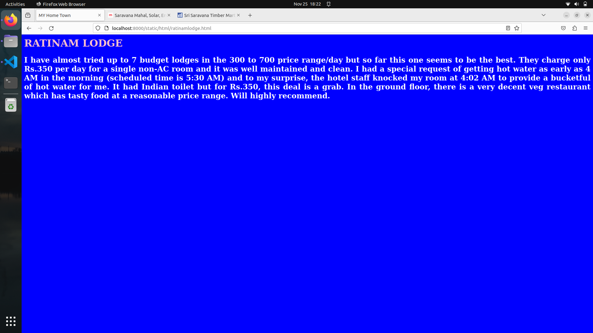
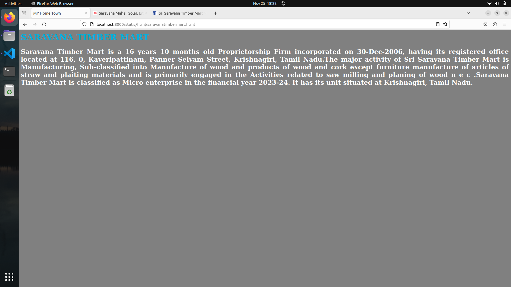
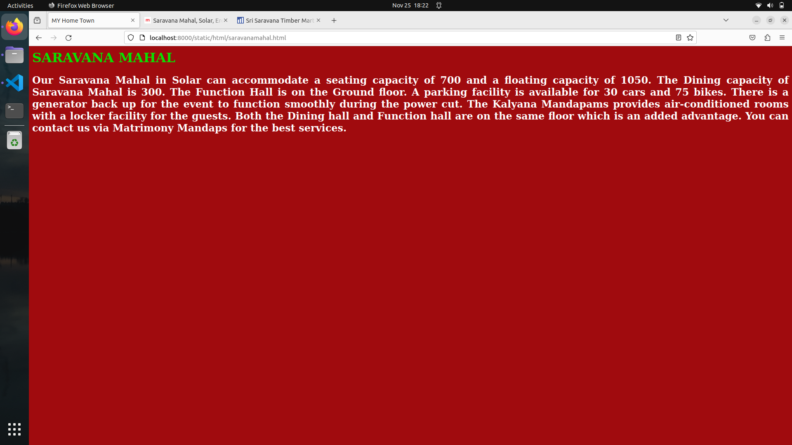
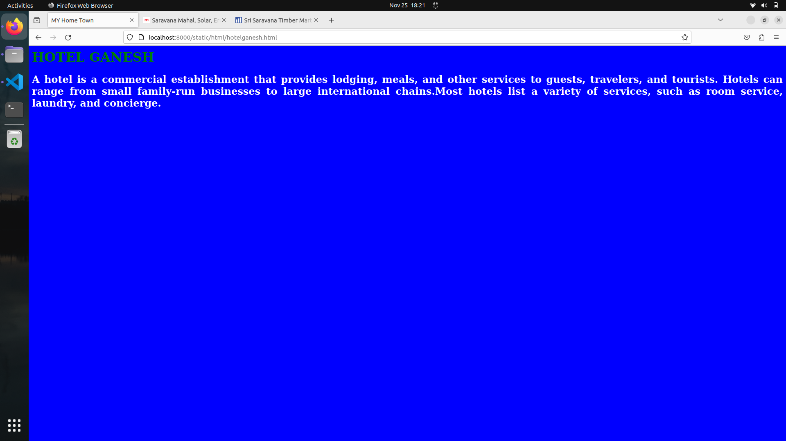
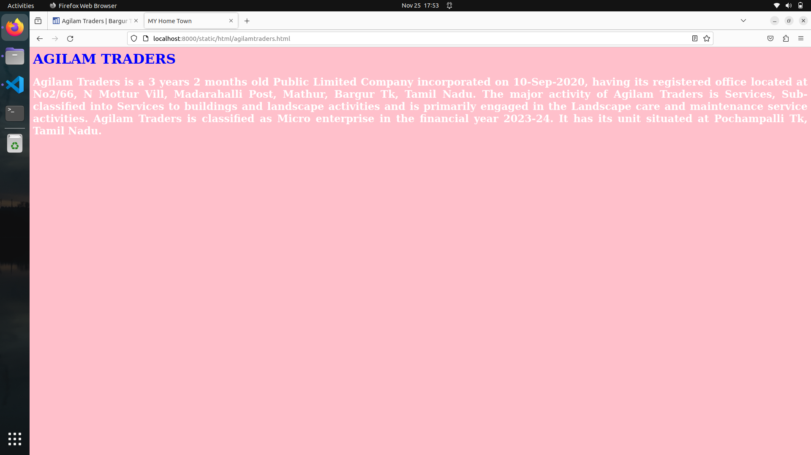

# Places Around Me
## AIM:
To develop a website to display details about the places around my house.

## Design Steps:

### Step 1:
Create a Django admin Interface.
### Step 2:
Download your city map from Google.
### Step 3:
usin```<map> tag name the map.
### Step 4:
Create clickable regions in the image using'''<area>```tag.
### Step 5:
Write the HTML program for all the region identified.
### Step 6:
Execute the program and publish there.
## Code:
```
map.html
<!DOCTYPE html>
<html>
    <head>
        <title>
            Imagesmaps Demo
        </title>
    </head>
    <body>
       <h1>Imagesmaps Demo
        
        <map name="image_map">
          <area alt="ratinamlodge" title="ratinamlodge" href="ratinamlodge.html" coords="343,135,398,190" shape="rect">
          <area alt="saravanatimbermart" title="saravanatimbermart" href="saravanatimbermart.html" coords="425,197,552,253" shape="rect">
          <area alt="saravanamahal" title="saravanamahal" href="saravanamahal.html" coords="145,263,271,323" shape="rect">
          <area alt="hotelganesh" title="hotelganesh" href="hotelganesh.html" coords="56,23,194,112" shape="rect">
          <area alt="agilamtraders" title="agilamtraders" href="agilamtraders.html" coords="484,400,596,471" shape="rect">
        </map>
         

       </h1>
    </body>
</html
ratinamlodge.html
<html>
    <head>
        <title>MY Home Town</title>
    </head>
    <body bgcolor="blue">
        <h1 align="centre">
            <font color="pink">RATINAM LODGE</font>
        </h1>
        <h3 align="centre"
        <hr size="3" color="red">
        <p align="justify">
            <font face="Georgia" size="5" color="white">
                I have almost tried up to 7 budget lodges in the 300 to 700 price range/day but so far this one seems to be the best. 
                They charge only Rs.350 per day for a single non-AC room and it was well maintained and clean. I had a special request 
                of getting hot water as early as 4 AM in the morning (scheduled time is 5:30 AM) and to my surprise, the hotel staff 
                knocked my room at 4:02 AM to provide a bucketful of hot water for me. It had Indian toilet but for Rs.350, this deal 
                is a grab. In the ground floor, there is a very decent veg restaurant  which has tasty food at a reasonable 
                price range. Will highly recommend.
            </font>
        </p>
    </body>
</html>

sravanatimbermart.html
<html>
    <head>
        <title>MY Home Town</title>
    </head>
    <body bgcolor="grey">
        <h1 align="centre">
            <font color="sky blue">SARAVANA TIMBER MART</font>
        </h1>
        <h3 align="centre"
        <hr size="3" color="violet">
        <p align="justify">
            <font face="Georgia" size="5" color="white">
                Saravana Timber Mart is a 16 years 10 months old Proprietorship Firm incorporated on 30-Dec-2006, 
                having its registered office located at 116, 0, Kaveripattinam, Panner Selvam Street, Krishnagiri, 
                Tamil Nadu.The major activity of Sri Saravana Timber Mart is Manufacturing, Sub-classified into 
                Manufacture of wood and products of wood and cork except furniture manufacture of articles of straw 
                and plaiting materials and is primarily engaged in the Activities related to saw milling and planing 
                of wood n e c .Saravana Timber Mart is classified as Micro enterprise in the financial year 2023-24. 
                It has its unit situated at Krishnagiri, Tamil Nadu.
             </font>
        </p>
    </body>
</html>

saravanamahal.html
<html>
    <head>
        <title>MY Home Town</title>
    </head>
    <body bgcolor="navy blue">
        <h1 align="centre">
            <font color="pale pink">SARAVANA MAHAL</font>
        </h1>
        <h3 align="centre"
        <hr size="3" color="brown">
        <p align="justify">
            <font face="Georgia" size="5" color="white">
                Our Saravana Mahal in Solar can accommodate a seating capacity of 700 and a floating capacity of 1050. 
                The Dining capacity of Saravana Mahal is 300. The Function Hall is on the Ground floor. A parking 
                facility is available for 30 cars and 75 bikes. There is a generator back up for the event to function 
                smoothly during the power cut. The Kalyana Mandapams provides air-conditioned rooms with a locker facility
                 for the guests. Both the Dining hall and Function hall are on the same floor which is an added advantage. 
                 You can contact us via Matrimony Mandaps for the best services.
            </font>
        </p>
    </body>
</html>

hotelganesh.html
<html>
    <head>
        <title>MY Home Town</title>
    </head>
    <body bgcolor="blue">
        <h1 align="centre">
            <font color="green">HOTEL GANESH</font>
        </h1>
        <h3 align="centre"
        <hr size="3" color="yellow">
        <p align="justify">
            <font face="Georgia" size="5" color="white">
                A hotel is a commercial establishment that provides lodging, meals, and other services to guests, travelers, and tourists. 
                Hotels can range from small family-run businesses to large international chains.Most hotels list a variety of services, 
                such as room service, laundry, and concierge.
            </font>
        </p>
    </body>
</html>
 
 saravanatimbermart.html
 <html>
    <head>
        <title>MY Home Town</title>
    </head>
    <body bgcolor="grey">
        <h1 align="centre">
            <font color="sky blue">SARAVANA TIMBER MART</font>
        </h1>
        <h3 align="centre"
        <hr size="3" color="violet">
        <p align="justify">
            <font face="Georgia" size="5" color="white">
                Saravana Timber Mart is a 16 years 10 months old Proprietorship Firm incorporated on 30-Dec-2006, 
                having its registered office located at 116, 0, Kaveripattinam, Panner Selvam Street, Krishnagiri, 
                Tamil Nadu.The major activity of Sri Saravana Timber Mart is Manufacturing, Sub-classified into 
                Manufacture of wood and products of wood and cork except furniture manufacture of articles of straw 
                and plaiting materials and is primarily engaged in the Activities related to saw milling and planing 
                of wood n e c .Saravana Timber Mart is classified as Micro enterprise in the financial year 2023-24. 
                It has its unit situated at Krishnagiri, Tamil Nadu.
            </font>
        </p>
    </body>
</html>
```


## Output:







## Result:
The program implementing image maps using HTML is executed successfully.